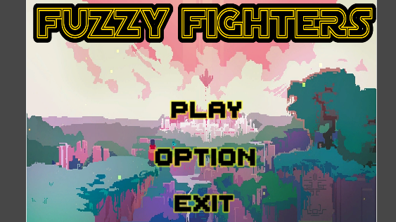
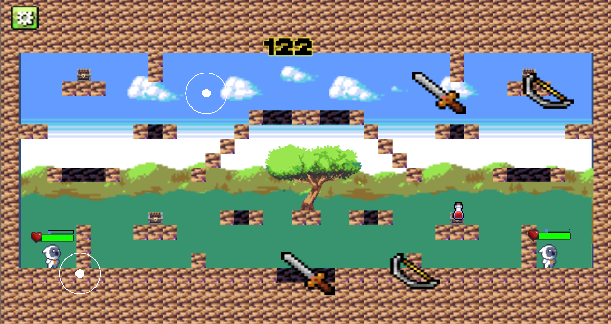

# DJ-ELM0

# 
Created on [flamingtext](https://flamingtext.com)

## Software Development Practices 2-D Fighting Game

## Members: 
Maaka, Lance, Edward, Jordan, Dion.   

This is the master branch.

## Description

This is a video game that focuses on the fighting game genre. It involves close combat of two players selected from a limited range of characters in a fixed stage. The characters may attack their opponent until their health reaches zero or the rounds time expires.

## Motivation

"Fuzzy Fighters" is 2-D fighting game application that we created to be the main project for our COMP602 Software Development Practice class. 
This project was to help us understand the role of software engineering processes and practices in managing the complexity, quality and timeliness of software development projects.
This also includes collaborating within a team to scope, plan and manage the development of the project.

We also wanted to produce a game that was simple enough for anyone to play as well keeping it fun and enjoyable for all. You can fight against an A.I character in the single player mode or against another user in the multiplayer mode.

## Code Style

 - C# Standard

## Screenshots

#### This is the main menu with the title of the game, and it's play, option and exit buttons.

## 

#### An in-game view during game play. The character sprites, timer, weapons, buttons and map are visible.

## 

## Tech/Framework used

- [SCRUM](https://www.scrum.org/resources/what-is-scrum#:~:text=Scrum%20is%20a%20framework%20within,team%20collaboration%20on%20complex%20products.)

## Features

- [X] PvE/Single Player Mode
- [ ] PVP/Mulitplayer Mode
- [X] Interactive item spawns
- [X] Dynamic map and backgrounds

## Code Example

```cs
public enum weaponName
{
    hand, sowrd, ax
}
public static weaponName current_weapon = weaponName.hand;
public GameObject bulletPrefab;
public GameObject specialBulletPrefab;
void Start()
{
    rb = GetComponent<Rigidbody2D>();
}

// Update is called once per frame

```

## Built with

- [Unity](https://unity.com/)
